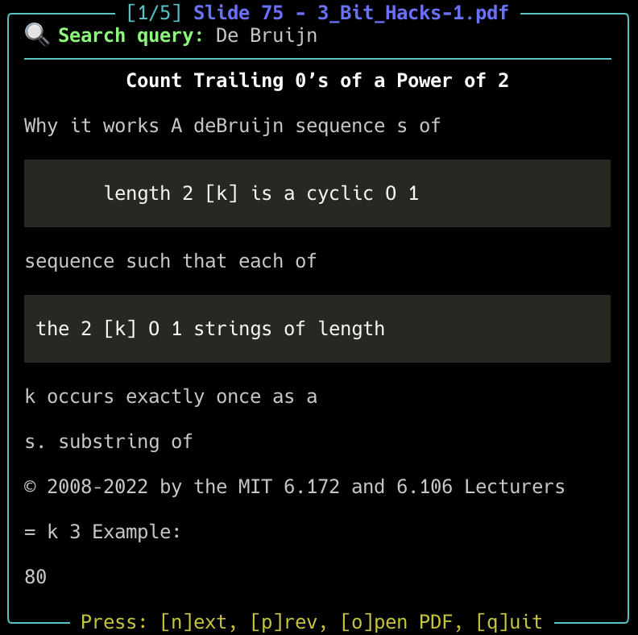

# PDF Semantic Search Tool

The idea for this project came to me during a lecture on De Bruijn Graph Assembly in my Algorithms for Bioinformatics class. I got momentarily distracted, trying to figure out why the name "De Bruijn" sounded so familiar. It’s not quite the same spelling as Man City’s captain, Kevin De Bruyne, but I was convinced I had seen "De Bruijn" somewhere before.

I checked the Wikipedia page, hoping it would refresh my memory. Eventually, it clicked. I had come across the name in a different context, during my Software Performance Engineering class. I searched through the lecture slides stored on my laptop and, after a bit of digging, found it. The name appeared in a section about using permutations to efficiently compute `log(x)` (check slides 45 and 47 of [MIT's OCW version](https://ocw.mit.edu/courses/6-172-performance-engineering-of-software-systems-fall-2018/resources/mit6_172f18_lec3/)). The application was very different from what we were studying in the bioinformatics class, but the shared terminology stuck with me.

This gave me the idea to build a CLI tool that could search through all my lecture slides and pick relevant content based on a query. In short, I needed a system that could scan a collection of PDFs and identify the most relevant slides for a given prompt.
## What I wanted to build

The goal was straightforward: given a prompt (like “De Bruijn”), find the most relevant slides from a bunch of PDFs. In other words, a lightweight Retrieval-Augmented Generation (RAG) system.

With some help from ChatGPT, this was the outline:

1. Extract text and metadata from all the PDFs (slide number, file name, etc.)
2. Embed everything using a language model so we can compare semantic similarity
3. Build a CLI interface that takes a prompt, finds matching slides, and displays them nicely

## Tooling & Tech Stack

After a bit of experimentation, I landed on the following tools:

- **`pymupdf4llm`** – for clean text extraction from PDFs, outputting in Markdown (great for rendering)
- **LangChain + ChromaDB** – to manage embeddings and vector search
- **`rich`** – for building an interactive and nicely formatted terminal UI

## Extracting Text from PDFs

### Basic Text Extraction (Using `pymupdf`)

```python
import pymupdf

doc = pymupdf.open("example2.pdf")
for i, page in enumerate(doc):
	print(f"-- Page {i+1}:")
	text = page.get_text()
	print(text)

doc.close()
```

### Enhanced Markdown Extraction (Using `pymupdf4llm`)

```python
import pymupdf4llm
import pymupdf

doc = pymupdf.open("example2.pdf")

md_text = pymupdf4llm.to_markdown(doc, pages=[10, 11], write_images=True, page_chunks=True)

for page in md_text:
	print("*** Of interest:")
	print("file_path:", page['metadata']['file_path'])
	print("page number:", page['metadata']['page'])
	print("page text:", page['text'])  # in Markdown format
```

### Final Version of Text Extraction (found in `create_db.py`)

```python
def load_pdf_as_markdown(pdf_path: str) -> list[Document]:
	"""Load a PDF file and convert it to markdown documents."""
	doc = pymupdf.open(pdf_path)
	
	# Get total number of pages
	total_pages = len(doc)
	
	# Convert each page to markdown
	pages = to_markdown(doc, page_chunks=True)
	
	documents = [Document(
		page_content=page['text'],
		metadata={
			'source': pdf_path,
			'page': page['metadata']['page'],  # slide number
			'total_pages': total_pages
		}
	) for page in pages]
	
	return documents
```

## Vector Database: ChromaDB

I chose ChromaDB over FAISS and Qdrant due to its simplicity and suitability for local development. It integrates well with the Langchain ecosystem and provides a fast, dev-friendly setup.

Results are retrieved simply using the following call:
```python
vectorstore = Chroma(persist_directory=CHROMA_DIR, embedding_function=embedding_model)
results = vectorstore.similarity_search(query, k=k)
```

## Embedding Model

Langchain supports integration with Hugging Face models from the `sentence-transformers` library. Based on ChatGPT’s recommendation and the [SBERT rankings](https://sbert.net/docs/sentence_transformer/pretrained_models.html), I selected the `all-MiniLM-L6-v2` model. Per the rankings page, it offers a good trade-off between performance and speed. ChromaDB also lists this model as a default option ([source](https://docs.trychroma.com/docs/collections/configure#embedding-function-configuration)).

## Interactive Terminal UI

I explored both `prompt_toolkit` and `rich.live` to build an interactive UI. While `prompt_toolkit` has some cool features, it was a pain to get Markdown rendering working. Even ChatGPT’s ANSI hack didn’t work out.

In the end, **`rich`** won out for its Markdown support and ease of use. It just worked.

## Code and Usage

The project code is available on GitHub: [Asaad47/pdf_search](https://github.com/Asaad47/pdf_search).

There are two main scripts:

- `create_db.py`: processes PDFs and builds the vector database
- `search.py`: takes a query and shows relevant slides in the terminal

###  Example Workflow:

1. Add PDFs to the `PDF_PATHS` list in `config.yaml`
2. Run `python create_db.py` to build the database.
3. Search using:
`python search.py "YOUR QUERY HERE" -i`

> Note: On my machine, `create_db.py` took about 879 seconds and used roughly 1.91 GB of RAM to process 320 files.

Example:
`python search.py "De Bruijn" -i -x cs249`



The screenshot shows the slide where I found the reference to the efficient computation of `log(x)`, or at least one nearby. While the Markdown rendering isn’t ideal for readability, it still provides a helpful indication of which file contains the relevant concepts related to the query.

## Future Improvements

-  Skip slides that are completely repeated (i.e. duplicated content)
-  Add an LLM summarizer that reads the top matches and gives a concise answer

## References

Some useful resources that helped me along the way:

- [ChromaDB Documentation](https://docs.trychroma.com/docs/overview/introduction)
- [RAG/LLM and PDF: Enhanced Text Extraction](https://artifex.com/blog/rag-llm-and-pdf-enhanced-text-extraction)
- [pymupdf RAG Example](https://github.com/pymupdf/RAG/blob/main/examples/country-capitals/country-capitals.py)
- [PyMuPDF Documentation](https://pymupdf.readthedocs.io/en/latest/rag.html)
- [SBERT Models](https://sbert.net/docs/sentence_transformer/pretrained_models.html)

